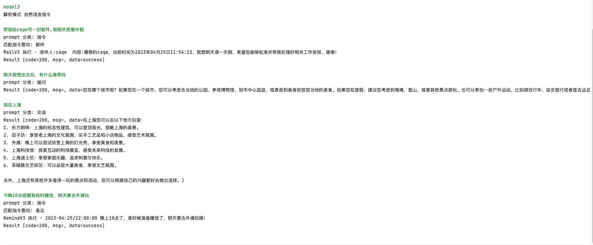

# 自然语言指令

通过gpt等api,解析自然语言的意向与参数,构造指令,从而让gpt获得调用外部服务的能力。

- openai 在 2023年06月14日 公布了 gpt_3p5_turbo_0613 模型，其中 CreateChatCompletionRequest 可以支持
  函数调用,可以说是完爆了这个项目的设计，不再需要编写各种prompt来教会gpt解析意向和参数
- 详见[这里](https://platform.openai.com/docs/guides/gpt/function-calling)

- 顺便安利一下自己写的2个库:

- [gpt-magic](https://github.com/WhiteMagic2014/gpt-magic)是官方api的调用封装库
- [gpt-magic-plus](https://github.com/WhiteMagic2014/gpt-magic-plus) 基于上面基本库的部分业务封装

# 设计

# 演示截图

