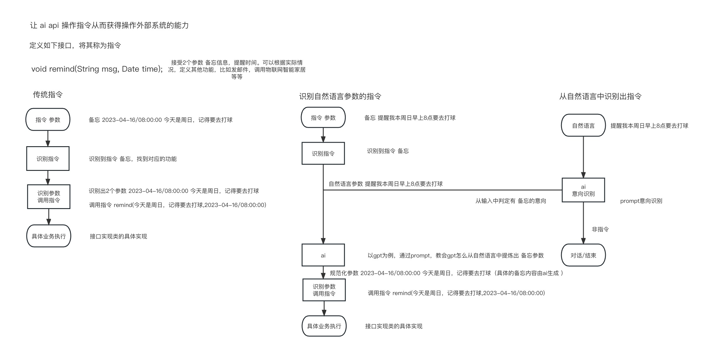

# 名称

# 目的

1. 自然语言指令，通过与gpt等ai模型结合,解析自然语言的意向与参数,构造指令
2. gpt等ai模型聊天功能，与自然语言指令集合，使得ai模型获得调用外部服务的能力
3. 基于以上2点，构建一个可识别自然语言指令的对话框架，定义相关接口规则，从而使得有类似需求的开发人员可以快速开发出可以满足个性化需求的ai对话系统

# 背景

1. 一般来说，机器/程序接受的指令都有一个严格的格式规范。(缺点 机器严格的格式规范，稍有误差可能就无法正常执行)
2. 大量聊天类ai模型呈现，但是作用局限于聊天。(缺点 无法操作干涉现实世界以达成更多的互动)

# 内容

### 指令定义
定义指令包含几个部分
- 指令意向：能够概括这个指令功能的词语， 比如 邮件，短信，电话...
- 指令意向解析实例：一些匹配该意向的自然语言实例
- 指令参数解析模版：一系列规则模版，用来和输入的自然语言构造参数解析prompt
- 指令参数校验：一系列验证逻辑，用来验证参数是否合理
- 指令执行代理：具体执行的功能，可以是外部的功能调用，系统内部本身的功能运用等等

### 指令注册

- 在解析器中注册指令
- 将所有注册的指令意向 构造为 意向池 
- 将所有注册的指令，根据其意向创建指令池（一种key—value模型，可以根据key快速查找到对应值的模型）

### 意向解析模块

- 在获得自然语言输入后，首先结合 指令意向池 与 实例池，构造出意向解析prompt，调用ai模型解析这句自然语言的意向
- 如果解析出的意向在 map中存在，则说明该输入的自然语言可以映射成一个指令（说明本系统可以提供服务），则进入指令参数构造模块
- 如果解析出的意向在 map中不存在，说明该输入没有指令意向(比如输入是"你好"，这句话没有任何指令意向)，
  或者本系统不提供该意向的服务（比如注册的指令中只有发邮件的功能，但是该输入是"帮我打开客厅的灯"），
  那么无视本次输入，等待下一次的输入。当然，可以将所有未识别的或者key—value模型中不存在的输入，都归纳为[交谈]
  意向，可以让ai模型与用户交谈对话，以改善用户的体验。

### 指令参数构造模块

- 使用意向从map中获得到指令。
- 从指令中获得 指令参数解析模版，结合自然语言输入构造 prompt，调用ai模型构造指令参数
- 由于ai模型的不确定性，构造出的指令参数需要校验，从指令中获得 校验功能，检查是否合规
- 如果校验结果通过 则调用执行代理，执行指令
- 如果校验结果没有通过，可以尝试重试再次解析，或者告知用户无法识别并作记录，方便后期优化解析模版

### 指令执行

- 执行代理，具体情况根据不同系统，不同的业务实现有所不同

# 有益效果

1. 让机器可以识别自然语言
2. 让ai聊天模型可以操作外部服务
3. 可以快速上手开发可以操作外部服务的ai对话系统

# 附图

